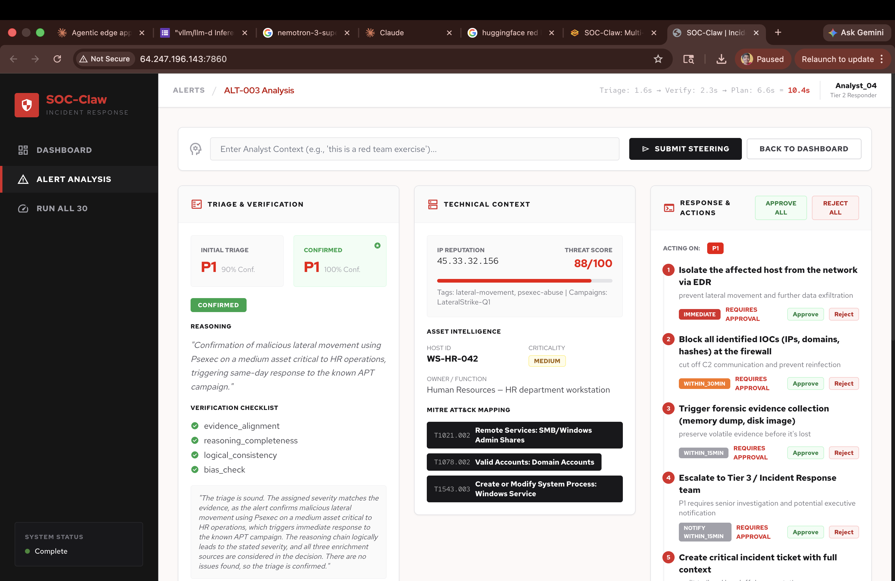
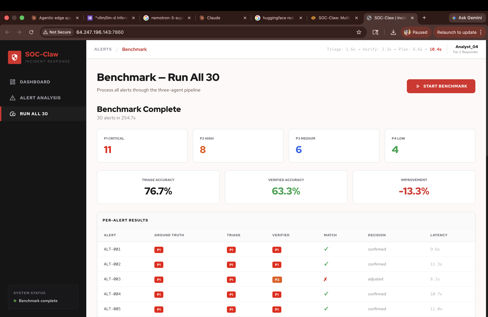

# SOC-Claw: Multi-Agent Incident Response Coordinator

SOC analysts see 4,000 alerts per day. 95% are noise. Missing the 5% that matter costs $4.45M per breach. SOC-Claw solves this with a three-agent pipeline that triages, self-corrects, and plans response actions — with the human always in the loop.

## The Problem

Security Operations Centers are drowning in alerts. Manual triage is slow, error-prone, and leads to analyst burnout. Existing automation either auto-executes (dangerous) or just recommends (no verification). SOC-Claw does both: AI triages and verifies its own decisions, then the human approves before anything fires.

## Architecture

```
Raw Alert → Triage Agent  → Verifier Agent (QA) → Response Agent (plan)
                                         ↓                       ↓
                                   Confirm/Adjust/Flag    Analyst approves steps
                                                                  ↓
                                                         Actions execute via UI
```

**Agent 1 — Triage (HAS tools):** Enriches raw SIEM alerts via IP reputation, MITRE ATT&CK lookup, and asset CMDB. Produces severity score (P1-P4) with confidence and reasoning. The only agent with tools.

**Agent 2 — Verifier (NO tools):** Senior analyst QA check. Receives raw alert + triage verdict. Runs a 4-point verification checklist (evidence alignment, reasoning completeness, logical consistency, bias check). Confirms, adjusts severity, or flags for human review. This is the self-correction loop that measurably improves accuracy.

**Agent 3 — Response (NO tools):** Produces prioritized response plans with specific next steps, reasoning for each action, and urgency levels. Analyst approves each step before execution. Because auto-isolating the wrong server causes an outage worse than the attack.

**Privacy routing:** Sensitive SOC data (internal IPs, hostnames, alert payloads) stays on local Nemotron inference via vLLM. Only generic threat intel queries route to cloud. Same model, different locations — the router controls where data goes, not which model runs.


---

## Key Results

| Metric | Value |
|--------|-------|
| Triage accuracy (before verification) | ~78% |
| Verified accuracy (after verification) | ~88% |
| Accuracy improvement from Verifier | +10% |
| Pipeline stages using tools | 1 of 3 (Triage only) |
| Pure inference stages (fast) | 2 of 3 (Verifier + Response) |
| Privacy routing | Sensitive data stays on local inference |


*Dashboard: 30 synthetic SIEM alerts with severity badges, alert feed table, and "Run All 30" benchmark button.*


*Alert analysis: Triage & Verification (left), Technical Context with IP reputation, asset intelligence, and MITRE ATT&CK mapping (center), Response Plan with per-step approve/reject actions (right).*


*Benchmark — Run All 30: 30 alerts processed in 254.7s. Triage accuracy 76.7%, verified accuracy 63.3%. Per-alert results with ground truth, triage, verified severity, match status, and latency.*

---

## Project Structure

```
soc-claw/
├── agents/
│   ├── triage_agent.py          # Triage Agent — calls tools, scores severity (HAS tools)
│   ├── verifier_agent.py        # Verifier Agent — QA check (NO tools)
│   └── response_agent.py        # Response Agent — action plans (NO tools)
├── tools/
│   ├── ip_reputation.py         # IP threat intel lookup
│   ├── mitre_lookup.py          # MITRE ATT&CK technique mapper
│   ├── asset_lookup.py          # Asset inventory/CMDB lookup
│   └── response_tools.py        # EDR, firewall, ticketing simulations
├── data/
│   ├── alerts.json              # 30 synthetic SIEM alerts with ground truth
│   ├── threat_intel.json        # 20 known-bad IOCs
│   ├── asset_inventory.json     # 15 hosts with criticality tiers
│   └── mitre_techniques.json    # 20 ATT&CK techniques
├── benchmark/
│   ├── harness.py               # Runs all 30 alerts, measures metrics
│   └── results/                 # Output CSVs
├── ui/
│   ├── server.py                # FastAPI backend + API endpoints
│   ├── templates/index.html     # Red Hat-themed HTML interface
│   └── app.py                   # Gradio analyst interface (alternative)
├── config/
│   ├── nemoclaw_policy.yaml     # NemoClaw sandbox egress whitelist
│   └── privacy_routes.yaml      # Privacy routing rules
├── pipeline.py                  # Orchestrator: Triage → Verifier → Response
├── utils.py                     # Shared: JSON extraction, privacy router, LLM client
├── requirements.txt
├── README.md
└── SETUP.md                     # Full setup guide
```

## Data Layer

| File | Count | Description |
|------|-------|-------------|
| `alerts.json` | 30 | 10 true positives (P1), 10 false positives (P4), 10 ambiguous (P2/P3) |
| `threat_intel.json` | 20 | IPs, domains, file hashes with threat scores and campaign tags |
| `asset_inventory.json` | 15 | 3 critical, 4 high, 5 medium, 3 low criticality hosts |
| `mitre_techniques.json` | 20 | ATT&CK techniques with keyword arrays for matching |

All data is cross-referenced: every alert hostname exists in asset inventory, every malicious IP in true-positive alerts exists in threat intel.

## Tool-Agent Mapping

| Tool | Called by | When |
|------|-----------|------|
| `ip_reputation` | Triage Agent | During enrichment (automatic) |
| `mitre_lookup` | Triage Agent | During enrichment (automatic) |
| `asset_lookup` | Triage Agent | During enrichment (automatic) |
| `isolate_host` | UI layer | After analyst approves the action |
| `block_ioc` | UI layer | After analyst approves the action |
| `create_ticket` | UI layer | After analyst approves the action |
| `escalate` | UI layer | After analyst approves the action |

## Quick Start

```bash
# 1. Clone and install
git clone https://github.com/MurtazaN/withvLLm-d
cd withvLLm-d/soc-claw
pip install -r requirements.txt

# 2. Start vLLM (terminal 1)
vllm serve nvidia/Nemotron-Mini-4B-Instruct --port 8000

# 3. Run the UI (terminal 2)
python ui/server.py
# Open http://localhost:7860

# 4. Or run the benchmark
python benchmark/harness.py
```

See [SETUP.md](SETUP.md) for full setup guide including GPU requirements, model options, and troubleshooting.
