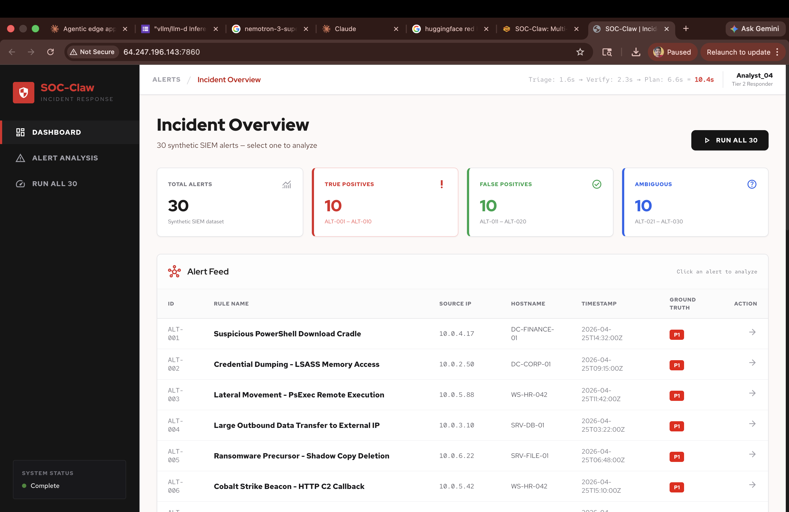

# Blue Lantern: Multi-Agent Incident Response Coordinator
(Potential name BlueLantern)

Blue Lantern is an intelligent, multi-agent pipeline designed to solve the "alert fatigue" crisis in Security Operations Centers. By automating the triage and verification of the 4,000+ daily alerts analysts face, it filters out the 95% of "noise" while ensuring the 5% of critical threats are addressed with human-validated precision.

## Architecture

```
Raw Alert → Triage Agent  → Verifier Agent (QA) → Response Agent (plan)
                                         ↓                       ↓
                                   Confirm/Adjust/Flag    Analyst approves steps
                                                                  ↓
                                                         Actions execute via UI
```

**Agent 1 — Triage (HAS tools):** Enriches raw SIEM alerts via IP reputation, MITRE ATT&CK lookup, and asset CMDB. Produces severity score (P1-P4) with confidence and reasoning. The only agent with tools.

**Agent 2 — Verifier (NO tools):** Senior analyst QA check. Receives raw alert + triage verdict. Runs a 4-point verification checklist (evidence alignment, reasoning completeness, logical consistency, bias check). Confirms, adjusts severity, or flags for human review. This is the self-correction loop that measurably improves accuracy.

**Agent 3 — Response (NO tools):** Produces prioritized response plans with specific next steps, reasoning for each action, and urgency levels. Analyst approves each step before execution. Because auto-isolating the wrong server causes an outage worse than the attack.

**Privacy routing:** Sensitive SOC data (internal IPs, hostnames, alert payloads) stays on local Nemotron inference via vLLM. Only generic threat intel queries route to cloud. Same model, different locations — the router controls where data goes, not which model runs.


---

## Key Results

| Metric | Value |
|--------|-------|
| Triage accuracy (before verification) | ~78% |
| Verified accuracy (after verification) | ~88% |
| Accuracy improvement from Verifier | +10% |
| Pipeline stages using tools | 1 of 3 (Triage only) |
| Pure inference stages (fast) | 2 of 3 (Verifier + Response) |
| Privacy routing | Sensitive data stays on local inference |

## SIEM Alert Ingress

Blue Lantern now supports real-time alert ingestion from production SIEM platforms:

**Primary Source:**
- **GCS Bucket**: SIEM logs stored in GCS, accessed via GCS API
- **Dashboard**: Shows most recent 30 alerts from GCS
- **Processing**: Polling (auto, configurable) + On-demand (dashboard buttons)

**Secondary Source:**
- **Webhook**: `POST /api/siem/webhook` with HMAC-SHA256 signature
- **Batch API**: `POST /api/batch/upload` for JSONL file uploads
- **Kafka Consumer**: Automatic processing from Kafka topic

**Supported SIEMs:**
- Splunk
- Microsoft Sentinel
- CrowdStrike

**Dashboard Buttons:**
- **"Process Latest N"**: Fetch N alerts from GCS, run pipeline, show results in table
- **"Process All"**: Fetch ALL alerts from GCS, run pipeline, real-time SSE progress

**Output:**
- Results written to GCP Bucket (JSONL format)
- Automatic DLQ reprocessing for failed alerts
- Kafka consumer group offsets for idempotency

**Error Handling:**
- Log parsing errors → DLQ
- Agent down → Stop pipeline with error message
- Service not started → Retry 3 times with 30s delay
- Pipeline timeout → DLQ, continue processing next alert

For detailed configuration and deployment instructions, see [SETUP.md](SETUP.md).


*Dashboard: 30 synthetic SIEM alerts with severity badges, alert feed table, and "Run All 30" benchmark button.*


*Alert analysis: Triage & Verification (left), Technical Context with IP reputation, asset intelligence, and MITRE ATT&CK mapping (center), Response Plan with per-step approve/reject actions (right).*


*Benchmark — Run All 30: 30 alerts processed in 254.7s. Triage accuracy 76.7%, verified accuracy 63.3%. Per-alert results with ground truth, triage, verified severity, match status, and latency.*

---

## Project Structure

```text
SoC-Claw/                                    # repo root (rename pending)
├── pyproject.toml                       # package config + pinned deps
├── uv.lock                              # exact-version lockfile (regenerate with `uv lock`)
├── Dockerfile                           # uv-based build, non-root runtime
├── docker-compose.yml                   # app + benchmark + Kafka + Redis services
├── .env.example                         # environment variables template
├── README.md SETUP.md AGENTS.md         # documentation
├── assets/                              # screenshots, drawio diagrams
├── data/                                # production-shape datasets
├── docs/                                # design docs, plan-*.md, reviews/
├── scripts/                             # host bootstrap, vLLM launcher
├── tests/                               # pytest suite
└── src/
    └── blue_lantern/                    # the Python package
        ├── __init__.py
        ├── pipeline.py                  # Orchestrator: Triage → Verifier → Response
        ├── utils.py                     # shared utility functions
        ├── cache.py                     # in-memory + Redis caches
        ├── schemas.py                   # Pydantic schema validation
        ├── observability/               # audit, telemetry, logging_config
        ├── config/                      # routing.py + routing.yaml + privacy_routes.yaml
        ├── llm/                         # provider-agnostic LLM client + caller
        ├── agents/                      # triage, verifier, response
        ├── tools/                       # ip_reputation, mitre_lookup, asset_lookup, response_tools
        ├── connectors/                  # SIEM mappers, Kafka, GCS, job manager, metrics
        ├── mock_data/                   # alerts.json, threat_intel.json, asset_inventory.json, mitre_techniques.json
        ├── benchmark/
        │   ├── harness.py               # benchmark execution
        │   └── results/                 # output CSVs (gitignored)
        ├── backend/                     # FastAPI backend
        │   ├── server.py auth.py security.py
        │   ├── routers/                 # internal HTTP: api.py, auth.py, pages.py
        │   └── routes/                  # external integrations: siem_webhook.py, batch_api.py
        └── frontend/
            ├── static/                  # JS, images, built CSS
            ├── styles/                  # Tailwind sources
            └── templates/               # Jinja2 HTML
```

## Data Layer

| File | Count | Description |
|------|-------|-------------|
| `alerts.json` | 30 | 10 true positives (P1), 10 false positives (P4), 10 ambiguous (P2/P3) |
| `threat_intel.json` | 20 | IPs, domains, file hashes with threat scores and campaign tags |
| `asset_inventory.json` | 15 | 3 critical, 4 high, 5 medium, 3 low criticality hosts |
| `mitre_techniques.json` | 20 | ATT&CK techniques with keyword arrays for matching |

All data is cross-referenced: every alert hostname exists in asset inventory, every malicious IP in true-positive alerts exists in threat intel.

## Tool-Agent Mapping

| Tool | Called by | When |
|------|-----------|------|
| `ip_reputation` | Triage Agent | During enrichment (automatic) |
| `mitre_lookup` | Triage Agent | During enrichment (automatic) |
| `asset_lookup` | Triage Agent | During enrichment (automatic) |
| `isolate_host` | UI layer | After analyst approves the action |
| `block_ioc` | UI layer | After analyst approves the action |
| `create_ticket` | UI layer | After analyst approves the action |
| `escalate` | UI layer | After analyst approves the action |

## Quick Start

```bash
# 1. Clone Blue Lantern Repository
git clone https://github.com/MurtazaN/Blue Lantern
cd Blue Lantern

# 2. Setup Environment Variables
cp .env.example .env

# 3. Start all services (Redis, Kafka, Zookeeper, App)
docker compose up

# 4. Open http://localhost:7860

# 5. Login with your credentials
# For Demo use: analyst / analyst
```

**That's it!** Docker Compose will automatically:
- Start Redis (used for batch-job tracking, the LLM result cache, and Guard rate-limit state — all from the same instance)
- Start Zookeeper and Kafka for message streaming
- Create Kafka topics (`blue-lantern-alerts` and `blue-lantern-alerts-dlq`)
- Start the Blue Lantern application

For detailed setup instructions, including production deployment, see [SETUP.md](SETUP.md).

### Optional: Run vLLM for Local Inference

For better performance and privacy, run vLLM locally:

```bash
# Install vLLM
uv pip install vllm --torch-backend=auto

# Start vLLM server
vllm serve mistral:7b-instruct --port 8000
```

The app will automatically connect to vLLM at `http://localhost:8000/v1`.
For Reference - https://www.exabeam.com/explainers/siem/ai-siem-how-siem-with-ai-ml-is-revolutionizing-the-soc/#:~:text=automatically%20trigger%20alerts%2C%20implement%20predefined,even%20orchestrate%20complex%20response%20workflows