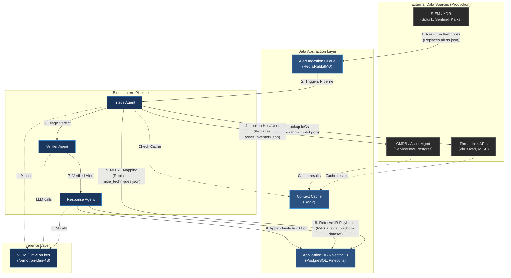

# Production Data Architecture

In a production environment, the static datasets currently in `data/` will be replaced by dynamic connections to enterprise security and IT systems. Blue Lantern will act as an orchestration layer, pulling in real-time data from these external sources.

## Current vs. Production Mapping

| Current Mock Data | Production Source Type | Real-World Examples | Integration Method |
| :--- | :--- | :--- | :--- |
| `advanced_siem_dataset.jsonl` | **SIEM / XDR Platform** | Splunk, Microsoft Sentinel, Elastic Security, CrowdStrike | Kafka/PubSub stream first; webhooks or REST API as bridges |
| `threat_intel_data.json` | **Threat Intelligence Platform (TIP)** | VirusTotal, MISP, Recorded Future, ThreatConnect | REST API, STIX/TAXII feeds |
| `asset_inventory_data.json` | **CMDB / Asset Management** | ServiceNow, AWS/Azure API, Device42, Jamf | REST API, PostgreSQL, GraphQL |
| `Mitre_framework_dataset.jsonl`| **Knowledge Base (Threat)** | MITRE ATT&CK Framework | PostgreSQL Database (synced periodically), Redis Cache |
| `incident_response_playbook_dataset.jsonl` | **Knowledge Base (Playbooks)** | SOAR Playbook Library, Vector Database | RAG over curated playbook corpus in Pinecone, optional fine-tuned model |

## Production Architecture Diagram

Here is a high-level picture of how data would flow in a production environment:

### Answering Your Questions

The production shape should be deliberately mixed rather than pushing every source into the same storage layer:

1. **Alerts:** Use Kafka as the primary event-stream ingress for SIEM alerts when available. Keep webhooks or REST endpoints as adapters for platforms that cannot publish directly to Kafka.
2. **Vector databases:** Do not route everything through Pinecone. Reserve VectorDB usage for unstructured playbook retrieval and other similarity search use cases. Threat intel, CMDB, and MITRE content should stay on APIs, relational databases, or cache-backed lookups.
3. **Caching:** Add the caching abstraction now, not after Kubernetes. Start with an in-memory fallback for local development, then back it with Redis as soon as you need shared state, rate-limit protection, or multi-worker deployment.
4. **RAG:** Use bounded RAG for playbooks rather than fully agentic RAG. Concrete shape: top-3 playbook snippets per alert, single retrieval (no re-query), keyed on the alert's mapped ATT&CK technique. The response stage stays planner-only, with retrieved context feeding a human-reviewable response plan.

### Architectural Decisions (pinned)

Locked-in choices to prevent re-litigation. Each row is the canonical answer; deeper rationale lives in the per-step plans.

| Decision | Choice | Rationale |
| :--- | :--- | :--- |
| Vector DB | Pinecone (managed in prod; Docker emulator for dev) | Production-ready managed service with a real local emulator — same SDK in both environments |
| Embedding strategy | Client-side in both dev and prod | Pinecone Inference is unavailable in Pinecone Local; client-side everywhere preserves dev/prod parity |
| Embedding model | `BAAI/bge-small-en-v1.5` (384-dim) | CPU-friendly, runs alongside vLLM, sufficient quality for playbook retrieval |
| Cache backend | In-memory now, Redis pre-k8s | Same interface for both; backend selection via `BLUE_LANTERN_REDIS_URL` |
| Cache method | Single `get_or_compute(key, compute, ttl)` | Eliminates miss-and-set bug class; minimal interface surface |
| Mock-to-prod transition | Per-source cutover, no runtime toggle | Each JSON loader replaced individually when its connector is ready |
| Audit log | Append-only writes from response agent → application DB | Read-only at query time; never mutated in place |

### Recommended Next Steps for Production Data

Sequencing follows the deployment roadmap (Docker → Compose → llm-d / k8s). Each step has a dedicated plan in [docs/](.):

1. **Pre-Compose — Cache interface with in-memory backend.** Route threat intel and CMDB lookups through it from day one. No external dependency yet; keeps the call sites stable. Plan: [plan-01-cache.md](plan-01-cache.md).
2. **Pre-k8s — Redis backend.** Set `BLUE_LANTERN_REDIS_URL` once you need shared state across multiple workers or pods. No call-site changes from step 1. Plan: same as step 1 — [plan-01-cache.md](plan-01-cache.md).
3. **Pre-k8s — Bounded RAG for playbooks.** Top-3 retrieval, single-pass, keyed on ATT&CK technique. Plan: [plan-02-rag-pinecone.md](plan-02-rag-pinecone.md).
4. **Cutover — replace data loaders, per source.** No runtime toggle between mock and real — each JSON loader is removed when its connector is ready. Plans: [plan-03-cutover-siem.md](plan-03-cutover-siem.md), [plan-04-cutover-threat-intel.md](plan-04-cutover-threat-intel.md), [plan-05-cutover-cmdb.md](plan-05-cutover-cmdb.md).
