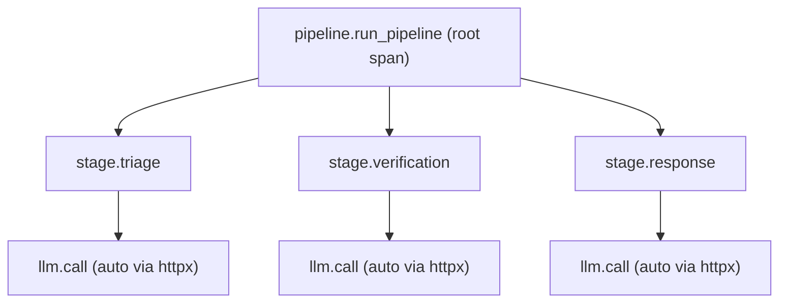

# Task 11: JSON Logging + OTEL Tracing (E4 + P4)

## Summary

Replace SOC-Claw's f-string-based logging with structured JSON output, and add OpenTelemetry distributed tracing with spans around the three pipeline stages and every LLM inference call. This gives production observability that integrates with Loki/Datadog/Grafana (logs) and Tempo/Jaeger/Datadog (traces) — the LangSmith pitch from the code review, without the LangChain dependency.

---

## Current State Audit

### Logging (E4 problem)

| File | Pattern | Count | Issue |
|------|---------|-------|-------|
| [utils.py](file:///Users/murtaza/temp/stuff/Hackathon/SoC-Claw/soc_claw/utils.py) | `logger.info(f"{timestamp} \| {route} \| ...")` | 6 functions | f-string pipes — unstructured, un-parseable by any aggregator |
| [server.py](file:///Users/murtaza/temp/stuff/Hackathon/SoC-Claw/soc_claw/backend/server.py) | `logger.exception("api_run failed for %s", ...)` | 4 call sites | Already uses `logging` but no JSON formatter |
| [pipeline.py](file:///Users/murtaza/temp/stuff/Hackathon/SoC-Claw/soc_claw/pipeline.py) | `logger.warning(...)` | 1 call site | Same — correct API, no formatter |
| [response_tools.py](file:///Users/murtaza/temp/stuff/Hackathon/SoC-Claw/soc_claw/tools/response_tools.py) | `print(f"[EDR] ...")` | 4 action functions | Bypasses logging entirely |
| [harness.py](file:///Users/murtaza/temp/stuff/Hackathon/SoC-Claw/soc_claw/benchmark/harness.py) | `print(f"...")` | ~20 lines | Human-formatted summary — intentional, keep as print |
| Tools (`ip_reputation.py`, `asset_lookup.py`, `mitre_lookup.py`) | `_logger.warning(...)` + inline `print()` tests | 3 files | `print()`s are in `if __name__` blocks — harmless |

### Tracing (P4 problem)

- **No OTEL integration exists.** `time.perf_counter()` is used manually in [utils.py:259-265](file:///Users/murtaza/temp/stuff/Hackathon/SoC-Claw/soc_claw/utils.py#L259-L265) and [pipeline.py:102-137](file:///Users/murtaza/temp/stuff/Hackathon/SoC-Claw/soc_claw/pipeline.py#L102-L137).
- The existing `_inference_ms`, `timing.triage_ms`, etc. metadata is the right data — it just needs to become spans instead of dict fields.

---

## Phase 1: Dependencies (Effort: S — <15 min)

### 1.1 Add packages to `pyproject.toml`

```diff
 dependencies = [
     "openai>=1.30",
     "fastapi",
     "uvicorn[standard]",
     "jinja2",
     "python-dotenv>=1.0",
     "pyyaml",
     "pydantic>=2.6",
+    "python-json-logger>=3.2",
+    "opentelemetry-api>=1.29,<2",
+    "opentelemetry-sdk>=1.29,<2",
+    "opentelemetry-exporter-otlp-proto-grpc>=1.29,<2",
+    "opentelemetry-instrumentation-fastapi>=0.50b0,<0.51",
+    "opentelemetry-instrumentation-httpx>=0.50b0,<0.51",
 ]
```

> [!NOTE]
> **Exporter transport choice.** `opentelemetry-exporter-otlp-proto-grpc` pulls in `grpcio` (~7 MB native wheel) and uses port **4317**. The HTTP variant `opentelemetry-exporter-otlp-proto-http` is lighter and uses port **4318**. Both work with Jaeger, Tempo, Datadog Agent, and Grafana Cloud. Sticking with gRPC because it's the more common production default; if container size becomes a concern, swap to HTTP — one-line dependency change, one env-var change (`OTEL_EXPORTER_OTLP_PROTOCOL=http/protobuf`), no code change.

> [!NOTE]
> **Pre-1.0 instrumentation packages.** `opentelemetry-instrumentation-*` packages ship as 0.x betas and have made breaking API changes across minor versions. Pinning `<0.51` so `uv lock` produces a reproducible build that won't silently break on the next minor release.

### 1.2 Lock and install

```bash
uv lock
uv sync
```

### Why these packages

| Package | Purpose |
|---------|---------|
| `python-json-logger` | JSON formatter for stdlib `logging` — one-line config, zero code changes to existing `logger.info(...)` calls |
| `opentelemetry-api` + `-sdk` | Core OTEL: `Tracer`, `Span`, context propagation |
| `opentelemetry-exporter-otlp-proto-grpc` | Export spans to any OTLP-compatible backend (Tempo, Jaeger, Datadog Agent, Grafana Cloud) |
| `opentelemetry-instrumentation-fastapi` | Auto-instruments FastAPI: creates a root span per HTTP request, sets `http.method`, `http.route`, `http.status_code` |
| `opentelemetry-instrumentation-httpx` | Auto-instruments the `httpx` transport that `openai.AsyncOpenAI` uses internally — gives you a child span for every `POST /v1/chat/completions` |

---

## Phase 2: JSON Structured Logging (Effort: M — ~45 min)

### 2.1 Create `soc_claw/logging_config.py` — single source of truth

**Chosen approach: configure the root logger (option A).** Configuring only the `"soc-claw"` logger would leave uvicorn / httpx / openai emitting plaintext while everything else emits JSON — a half-and-half stream that breaks aggregator parsers. Attaching the JSON handler to the **root** logger means every log line in the process — `soc-claw.*`, uvicorn access logs, httpx request logs, openai client logs — emits in the same format and lands in the same indexed fields downstream.

We also attach a `TraceContextFilter` that injects the active OTEL `trace_id` / `span_id` into every log record — enabling log↔trace correlation in Grafana / Datadog without any extra code at log sites.

**Output sink: stderr by default; `SOC_CLAW_LOG_FILE` redirects to a file (option B).** For CI / production / harness runs you may want to keep stderr clean and route JSON to a sidecar file for ingestion. When `SOC_CLAW_LOG_FILE` is set, `setup_logging()` uses a `FileHandler` (append mode) instead of the default `StreamHandler(sys.stderr)`. This composes with the harness's `WARNING`-by-default decision: an interactive harness run is silent on stderr, with optional verbose JSON written to disk.

```python
"""Centralized logging configuration for SOC-Claw.

Calling ``setup_logging()`` once at process startup configures the
**root** logger with a JSON formatter, so every log line — from
``soc-claw.*``, uvicorn, httpx, openai — emits as JSON. A
``TraceContextFilter`` injects the active OTEL trace_id/span_id into
each record, enabling log↔trace correlation.

The JSON formatter is ``python_json_logger.json.JsonFormatter``; it
serializes ``extra={}`` fields as top-level keys in the JSON line, so
log aggregators (Loki, Datadog, CloudWatch) can index them without
regex parsing.
"""

import logging
import os

from pythonjsonlogger.json import JsonFormatter


class TraceContextFilter(logging.Filter):
    """Inject OTEL trace_id / span_id into log records when a span is active.

    Imported lazily so the logging module doesn't pull in OTEL when
    tracing is disabled.
    """

    def filter(self, record: logging.LogRecord) -> bool:
        try:
            from opentelemetry import trace
        except ImportError:
            return True
        span = trace.get_current_span()
        ctx = span.get_span_context()
        if ctx.is_valid:
            record.trace_id = format(ctx.trace_id, "032x")
            record.span_id = format(ctx.span_id, "016x")
        return True


def setup_logging() -> None:
    """Configure the **root** logger tree for structured JSON output.

    - ``SOC_CLAW_LOG_LEVEL`` (default ``INFO``) sets the threshold.
    - ``SOC_CLAW_LOG_FILE`` (optional) redirects JSON output to a file in
      append mode instead of stderr. Useful for CI / harness runs where
      stderr should stay clean and the JSON stream is consumed later.
    """
    level_name = os.environ.get("SOC_CLAW_LOG_LEVEL", "INFO").upper()
    level = getattr(logging, level_name, logging.INFO)

    formatter = JsonFormatter(
        fmt="%(asctime)s %(name)s %(levelname)s %(message)s",
        rename_fields={"asctime": "timestamp", "levelname": "level"},
        datefmt="%Y-%m-%dT%H:%M:%S%z",
    )

    log_file = os.environ.get("SOC_CLAW_LOG_FILE")
    if log_file:
        handler: logging.Handler = logging.FileHandler(log_file, mode="a", encoding="utf-8")
    else:
        handler = logging.StreamHandler()  # defaults to sys.stderr
    handler.setFormatter(formatter)
    handler.addFilter(TraceContextFilter())

    root = logging.getLogger()  # the root logger — captures everything
    root.handlers.clear()
    root.addHandler(handler)
    root.setLevel(level)

    # uvicorn ships its own handlers on the "uvicorn" / "uvicorn.access"
    # loggers; clearing them forces propagation to the root JSON handler.
    for name in ("uvicorn", "uvicorn.access", "uvicorn.error"):
        logger = logging.getLogger(name)
        logger.handlers.clear()
        logger.propagate = True
```

### 2.2 Refactor `utils.py` log functions — use `extra={}` instead of f-strings

Every `log_*` function currently builds a pipe-delimited f-string. Change them to pass structured fields via `extra={}`, which the JSON formatter serializes as top-level keys:

```python
# BEFORE (current)
def log_routing_decision(agent_name: str, route: str, reason: str, prompt: str):
    prompt_hash = hashlib.sha256(prompt[:500].encode()).hexdigest()[:12]
    timestamp = datetime.now(timezone.utc).isoformat()
    logger.info(f"{timestamp} | {route} | {reason} | {prompt_hash} | agent={agent_name}")

# AFTER
def log_routing_decision(agent_name: str, route: str, reason: str, prompt: str):
    prompt_hash = hashlib.sha256(prompt[:500].encode()).hexdigest()[:12]
    logger.info(
        "routing_decision",
        extra={
            "event": "routing_decision",
            "agent": agent_name,
            "route": route,
            "reason": reason,
            "prompt_hash": prompt_hash,
        },
    )
```

#### Full change list for `utils.py` log functions

| Function | Lines | `extra` fields |
|----------|-------|----------------|
| `log_routing_decision` | 133-137 | `event`, `agent`, `route`, `reason`, `prompt_hash` |
| `log_tool_call` | 140-146 | `event`, `tool`, `input_preview` (truncated), `latency_ms` |
| `log_inference` | 149-152 | `event`, `agent`, `route`, `latency_ms`, `prompt_hash` |
| `log_verification` | 155-161 | `event`, `alert_id`, `original_severity`, `verified_severity`, `decision`, `issues` |
| `log_response_plan` | 164-170 | `event`, `alert_id`, `num_steps`, `action_types`, `approval_required` |
| `log_analyst_action` | 173-176 | `event`, `alert_id`, `action`, `details` |

> [!TIP]
> The `extra` pattern is backward-compatible — if `setup_logging()` is never called (e.g. in tests), Python's default formatter ignores `extra` fields and prints the message string. Nothing breaks.

### 2.3 Migrate `response_tools.py` print() → logger

The four action functions (`isolate_host`, `block_ioc`, `create_ticket`, `escalate`) use `print()` for side-effect logging. Replace with `logger.info(...)`:

```python
# BEFORE
print(f"[EDR] {_now()} Isolating host: {hostname}")

# AFTER
logger.info("action_executed", extra={
    "event": "action_executed",
    "action_type": "isolate_host",
    "target": hostname,
})
```

### 2.4 Wire `setup_logging()` into entrypoints

Two entrypoints need the call:

**`soc_claw/backend/server.py`** — replace `logging.basicConfig(level=logging.INFO)`:
```python
if __name__ == "__main__":
    from soc_claw.logging_config import setup_logging
    setup_logging()
    import uvicorn
    uvicorn.run(app, host="0.0.0.0", port=7860)
```

**`soc_claw/benchmark/harness.py`** — add at the top of `__main__`:
```python
if __name__ == "__main__":
    from soc_claw.logging_config import setup_logging
    setup_logging()
    max_alerts = int(sys.argv[1]) if len(sys.argv) > 1 else 30
    metrics = asyncio.run(run_benchmark(max_alerts))
```

### 2.5 Keep harness `print()` statements as-is, but quiet the JSON firehose

The benchmark harness `print()` statements in `_print_summary`, `_format_row_line`, and `run_benchmark` are **intentional human-readable console output** — they're the CLI report, not log lines. Don't convert these.

To prevent ~540 JSON log lines (3 agents × ~6 events × 30 alerts) from drowning the summary table during interactive runs, the harness sets its log level to `WARNING` by default and respects an explicit `SOC_CLAW_LOG_LEVEL` override:

```python
# harness.py __main__
if __name__ == "__main__":
    from soc_claw.logging_config import setup_logging
    from soc_claw.telemetry import setup_tracing
    # Default WARNING: keep the summary table readable during interactive runs.
    # CI / production: set SOC_CLAW_LOG_LEVEL=INFO before invoking.
    os.environ.setdefault("SOC_CLAW_LOG_LEVEL", "WARNING")
    setup_logging()
    setup_tracing()
    ...
```

Server defaults remain `INFO` — request-level visibility is the whole point of running a server.

### Files changed in Phase 2

| File | Action |
|------|--------|
| `soc_claw/logging_config.py` | **NEW** — ~30 lines |
| `soc_claw/utils.py` | Edit 6 functions (lines 133-176) |
| `soc_claw/tools/response_tools.py` | Replace 4 `print()` calls in action functions |
| `soc_claw/backend/server.py` | Replace `logging.basicConfig` with `setup_logging()` |
| `soc_claw/benchmark/harness.py` | Add `setup_logging()` call |

---

## Phase 3: OpenTelemetry Tracing (Effort: M — ~60 min)

### 3.1 Create `soc_claw/telemetry.py` — OTEL bootstrap

The OTEL API already returns a no-op tracer when no provider is registered, so we don't need a module-global `_TRACER` cache — `trace.get_tracer("soc-claw")` is the right call everywhere.

`FastAPIInstrumentor.instrument()` patches the `FastAPI` class. To make sure the patch is in place before any `FastAPI(...)` instance is created, callers invoke `setup_tracing()` at **module import time** (before `app = FastAPI(...)`), not from a `lifespan` (which runs after construction).

```python
"""OpenTelemetry tracing bootstrap for SOC-Claw.

Calling ``setup_tracing()`` configures a ``TracerProvider`` with an OTLP
exporter. When ``OTEL_EXPORTER_OTLP_ENDPOINT`` is unset, the function
short-circuits and the OTEL API returns no-op tracers — dev runs are
unaffected.

MUST be called at module import time, before ``FastAPI(...)`` is
constructed, so ``FastAPIInstrumentor.instrument()`` (which patches the
class) takes effect on every app instance created afterward.

Also auto-instruments httpx (used by openai.AsyncOpenAI) so every
``POST /v1/chat/completions`` becomes a child span automatically.
"""

import os

from opentelemetry import trace
from opentelemetry.sdk.resources import Resource
from opentelemetry.sdk.trace import TracerProvider
from opentelemetry.sdk.trace.export import BatchSpanProcessor


def setup_tracing(service_name: str = "soc-claw") -> None:
    """Initialize OTEL tracing. Idempotent; no-op when endpoint is unset."""
    endpoint = os.environ.get("OTEL_EXPORTER_OTLP_ENDPOINT")
    if not endpoint:
        return  # OTEL API returns no-op tracers when no provider is set.

    from opentelemetry.exporter.otlp.proto.grpc.trace_exporter import (
        OTLPSpanExporter,
    )

    resource = Resource.create({"service.name": service_name})
    provider = TracerProvider(resource=resource)
    provider.add_span_processor(
        BatchSpanProcessor(OTLPSpanExporter(endpoint=endpoint))
    )
    trace.set_tracer_provider(provider)

    # Auto-instrument FastAPI (creates root span per request).
    # MUST run before FastAPI(...) is constructed.
    try:
        from opentelemetry.instrumentation.fastapi import FastAPIInstrumentor
        FastAPIInstrumentor().instrument()
    except ImportError:
        pass

    # Auto-instrument httpx (child spans for openai HTTP calls).
    try:
        from opentelemetry.instrumentation.httpx import HTTPXClientInstrumentor
        HTTPXClientInstrumentor().instrument()
    except ImportError:
        pass


def get_tracer() -> trace.Tracer:
    """Return the soc-claw tracer (no-op when ``setup_tracing`` wasn't called)."""
    return trace.get_tracer("soc-claw")
```

### 3.2 Add spans to `pipeline.py` — one per stage

Wrap each pipeline stage in a span. The span tree per alert looks like:



Span duration is automatic in every OTEL backend, so we only set **categorical** attributes (severity, decision, flags) — not redundant `latency_ms` fields. The existing `result["timing"]["*_ms"]` dict-fields are kept for the pipeline's JSON return value.

```python
# In pipeline.py — add to run_pipeline()
from soc_claw.telemetry import get_tracer

async def run_pipeline(alert: dict, steering_context: str = None) -> dict:
    tracer = get_tracer()

    with tracer.start_as_current_span(
        "pipeline.run_pipeline",
        attributes={"alert.id": alert.get("id", "unknown")},
    ) as root_span:
        result = { ... }

        # Stage 1: Triage
        with tracer.start_as_current_span("stage.triage") as triage_span:
            triage_start = time.perf_counter()
            triage_result = await run_triage(alert, steering_context)
            triage_ms = int((time.perf_counter() - triage_start) * 1000)
            triage_span.set_attribute("severity", triage_result.get("severity", ""))
            result["triage_result"] = triage_result
            result["timing"]["triage_ms"] = triage_ms

        # Stage 2: Verification
        with tracer.start_as_current_span("stage.verification") as verify_span:
            verify_start = time.perf_counter()
            verification_result = await run_verification(alert, triage_result, steering_context)
            verify_ms = int((time.perf_counter() - verify_start) * 1000)
            verify_span.set_attribute("decision", verification_result.get("decision", ""))
            ...

        # Stage 3: Response
        with tracer.start_as_current_span("stage.response") as resp_span:
            ...

        root_span.set_attribute("was_adjusted", result["was_adjusted"])
        root_span.set_attribute("was_flagged", result["was_flagged"])

        return result
```

### 3.3 Add a span inside `call_llm()` in `utils.py`

This is the single LLM call scaffold all three agents use. One span here instruments every inference call:

Span name is fixed (`llm.call`); the agent identity becomes an attribute. Standard OTEL practice — keeps span names low-cardinality so aggregation in Tempo / Jaeger works. `inference_ms` is dropped (redundant with span duration).

```python
async def call_llm(...) -> tuple[dict, int, str, str]:
    tracer = get_tracer()

    with tracer.start_as_current_span(
        "llm.call",
        attributes={
            "agent": agent_name,
            "model": MODEL_NAME,
        },
    ) as span:
        route, reason = route_request(user_content)
        span.set_attribute("route", route)
        span.set_attribute("route.reason", reason)

        # ... existing call logic ...

        span.set_attribute("parse.success", result is not None)
        span.set_attribute("used_retry", ...)  # True if retry path was taken
        span.set_attribute("used_default", ...)  # True if default_factory was used

        return result, inference_ms, route, content
```

### 3.4 Add a span for enrichment in `triage_agent.py`

```python
async def _run_enrichment(alert: dict) -> ...:
    from soc_claw.telemetry import get_tracer
    tracer = get_tracer()

    with tracer.start_as_current_span(
        "enrichment.run",
        attributes={"alert.id": alert.get("id", "")},
    ) as span:
        # ... existing concurrent enrichment ...
        span.set_attribute("tools_run", len(tasks))
        return ...
```

### 3.5 Wire `setup_tracing()` at module import time

`FastAPIInstrumentor.instrument()` patches the `FastAPI` class — it must run **before** any `FastAPI(...)` instance is constructed. A `lifespan` runs after construction, so it's the wrong hook. We call `setup_logging()` and `setup_tracing()` at the top of `server.py` (and `harness.py`), before `app = FastAPI(...)`. This works for both invocation modes (`python -m soc_claw.backend.server` and `uvicorn soc_claw.backend.server:app`):

```python
# soc_claw/backend/server.py — top of module
import logging
from fastapi import FastAPI
...

from soc_claw.logging_config import setup_logging
from soc_claw.telemetry import setup_tracing

setup_logging()
setup_tracing()  # MUST run before FastAPI(...) is created

logger = logging.getLogger("soc-claw.server")

app = FastAPI(title="SOC-Claw")
# ... middleware, routes ...

if __name__ == "__main__":
    import uvicorn
    uvicorn.run(app, host="0.0.0.0", port=7860)
```

```python
# soc_claw/benchmark/harness.py __main__
if __name__ == "__main__":
    import os
    from soc_claw.logging_config import setup_logging
    from soc_claw.telemetry import setup_tracing
    os.environ.setdefault("SOC_CLAW_LOG_LEVEL", "WARNING")
    setup_logging()
    setup_tracing()
    ...
```

The `logging.basicConfig(level=logging.INFO)` in `server.py:__main__` is removed — `setup_logging()` replaces it.

### Files changed in Phase 3

| File | Action |
|------|--------|
| `soc_claw/telemetry.py` | **NEW** — ~60 lines |
| `soc_claw/pipeline.py` | Add 3 `with tracer.start_as_current_span(...)` blocks around existing stages |
| `soc_claw/utils.py` | Add 1 span inside `call_llm()` |
| `soc_claw/agents/triage_agent.py` | Add 1 span inside `_run_enrichment()` |
| `soc_claw/backend/server.py` | Wire `setup_tracing()` via lifespan + `__main__` |
| `soc_claw/benchmark/harness.py` | Wire `setup_tracing()` in `__main__` |

---

## Phase 4: Docker / Compose Wiring (Effort: S — <15 min)

### 4.1 Add OTEL env vars to `docker-compose.yml`

```diff
 services:
   app:
     build: .
     image: soc-claw:dev
     container_name: soc-claw-app
     ports:
       - "7860:7860"
     env_file:
       - .env
     environment:
       SOC_CLAW_LOCAL_VLLM_URL: ${SOC_CLAW_LOCAL_VLLM_URL:-http://host.docker.internal:8000/v1}
+      OTEL_EXPORTER_OTLP_ENDPOINT: ${OTEL_EXPORTER_OTLP_ENDPOINT:-}
+      SOC_CLAW_LOG_LEVEL: ${SOC_CLAW_LOG_LEVEL:-INFO}
+      SOC_CLAW_LOG_FILE: ${SOC_CLAW_LOG_FILE:-}
```

> [!NOTE]
> If you set `SOC_CLAW_LOG_FILE` to an in-container path (e.g. `/var/log/soc-claw.jsonl`), bind-mount or volume-mount that path so the file survives container restarts and is readable from the host.

### 4.2 Add env vars to `.env.example`

```bash
# ── Observability ──────────────────────────────────────
# OTEL collector endpoint. Leave blank for no-op tracing (safe for dev).
# OTEL_EXPORTER_OTLP_ENDPOINT=http://localhost:4317

# Log threshold. Server defaults to INFO; harness defaults to WARNING
# (override for CI / production). Valid: DEBUG, INFO, WARNING, ERROR.
# SOC_CLAW_LOG_LEVEL=INFO

# Optional file sink. When set, JSON logs are appended to this path
# instead of stderr. Useful for CI / harness runs where stderr should
# stay clean. In Docker, mount the path so the file survives restarts.
# SOC_CLAW_LOG_FILE=
```

### 4.3 (Optional) Add a Jaeger service for local dev

```yaml
  # Uncomment to run a local trace collector (Jaeger all-in-one)
  # jaeger:
  #   image: jaegertracing/all-in-one:1.62
  #   ports:
  #     - "4317:4317"     # OTLP gRPC
  #     - "16686:16686"   # Jaeger UI
  #   restart: unless-stopped
```

> [!NOTE]
> This is commented out intentionally — it's a dev convenience, not a production service. In production, the OTLP endpoint points to Tempo/Datadog/Grafana Cloud.

---

## Phase 5: Verification (Effort: S — <15 min)

### 5.1 Verify JSON logging via unit test

A long-running server doesn't terminate, so piping to `head` would hang. Use `pytest` + `capsys` to capture and parse a log line at the formatter level:

```python
# tests/test_logging_config.py
import json
import logging

from soc_claw.logging_config import setup_logging


def test_emits_json_lines(capsys):
    setup_logging()
    logging.getLogger("soc-claw").info(
        "routing_decision",
        extra={"event": "routing_decision", "agent": "triage", "route": "local"},
    )
    err = capsys.readouterr().err.strip().splitlines()[-1]
    parsed = json.loads(err)
    assert parsed["message"] == "routing_decision"
    assert parsed["agent"] == "triage"
    assert parsed["route"] == "local"
    assert "timestamp" in parsed
    assert "level" in parsed


def test_trace_context_filter_no_active_span(capsys):
    """Without an active span, log line should still parse cleanly."""
    setup_logging()
    logging.getLogger("soc-claw").info("plain")
    parsed = json.loads(capsys.readouterr().err.strip().splitlines()[-1])
    assert "trace_id" not in parsed  # no span active → no trace_id injected
```

Manual sanity check (one alert through the running server):

```bash
# Terminal 1
python -m soc_claw.backend.server

# Terminal 2 — send one request, then check Terminal 1's stderr is JSON
curl -s -X POST http://localhost:7860/api/run/ALT-001 \
    -H "Cookie: ${SESSION_COOKIE}" -H "x-csrftoken: ${CSRF}" >/dev/null
```

### 5.2 Verify OTEL tracing (with local Jaeger)

```bash
# Start Jaeger
docker run -d --name jaeger -p 4317:4317 -p 16686:16686 jaegertracing/all-in-one:1.62

# Start SOC-Claw with OTEL enabled
OTEL_EXPORTER_OTLP_ENDPOINT=http://localhost:4317 python -m soc_claw.backend.server

# Run one alert, then open http://localhost:16686 → service=soc-claw
# You should see a trace tree: pipeline.run_pipeline → stage.triage → llm.call.triage → ...
```

### 5.3 Verify no-op mode (no OTEL endpoint set)

```bash
# Without OTEL_EXPORTER_OTLP_ENDPOINT, tracing is silent no-op
unset OTEL_EXPORTER_OTLP_ENDPOINT
python -m soc_claw.backend.server
# Should start normally, no errors, no span export attempts
```

---

### 5.4 Add a SETUP.md section

After Task 10 the runbook gained an auth section; this task adds an Observability section so `SETUP.md` stays accurate. New content covers:

- `SOC_CLAW_LOG_LEVEL` env var (server default `INFO`; harness default `WARNING`).
- `SOC_CLAW_LOG_FILE` env var (when set, JSON logs append to a file instead of stderr; recommended for harness/CI runs).
- `OTEL_EXPORTER_OTLP_ENDPOINT` env var (leave blank for no-op tracing).
- The optional Jaeger compose service for local trace inspection.
- A note that `trace_id` is injected into every JSON log line, so Grafana / Datadog can pivot from logs → traces.
- Why we configure the **root** logger (uvicorn / httpx / openai logs need to land in the same JSON stream as `soc-claw.*` for the aggregator to parse them).

---

## Full File Change Map

| File | Phase | Action | Lines Changed (est.) |
|------|-------|--------|---------------------|
| `pyproject.toml` | 1 | Edit deps | +5 |
| `soc_claw/logging_config.py` | 2 | **New file** (root logger + `TraceContextFilter`) | ~55 |
| `soc_claw/utils.py` | 2, 3 | Edit 6 log functions + add span to `call_llm` | ~50 |
| `soc_claw/tools/response_tools.py` | 2 | Replace 4 `print()` with `logger.info()` | ~15 |
| `soc_claw/telemetry.py` | 3 | **New file** | ~50 |
| `soc_claw/pipeline.py` | 3 | Wrap stages in spans | ~20 |
| `soc_claw/agents/triage_agent.py` | 3 | Wrap enrichment in span | ~8 |
| `soc_claw/backend/server.py` | 2, 3 | Module-import-time setup, replace `basicConfig` | ~10 |
| `soc_claw/benchmark/harness.py` | 2, 3 | Add `setup_logging()` + `setup_tracing()` (default `WARNING`) | ~7 |
| `docker-compose.yml` | 4 | Add env vars + optional Jaeger profile | +5 |
| `.env.example` | 4 | Add OTEL vars | +4 |
| `SETUP.md` | 5 | New "Observability" section | ~20 |
| `tests/test_logging_config.py` | 5 | **New file** — formatter sanity test | ~25 |

**Total: ~270 lines changed/added across 13 files. 3 new files.**

---

## Effort & Risk Summary

| Aspect | Assessment |
|--------|-----------|
| **Total effort** | **L** (half-day). Phase 2 and 3 are the bulk. |
| **Risk** | Low. JSON logging is a formatter swap — zero logic change. OTEL is additive and no-op when unconfigured. |
| **Breaking changes** | None. `extra={}` is backward-compatible with non-JSON formatters. |
| **Testing impact** | Existing tests (if any) are unaffected. New tests can assert on `extra` fields via `caplog`. |
| **Rollback** | Remove `setup_logging()` and `setup_tracing()` calls → back to f-string logging, no tracing. |

---

## Decisions baked into the plan

- **Log level**: `SOC_CLAW_LOG_LEVEL` defaults to `INFO` for the server, `WARNING` for the harness (overridable). DEBUG is opt-in via env var.
- **Log↔trace correlation**: `TraceContextFilter` injects `trace_id` / `span_id` into every JSON log line. Done.
- **Harness `print()` vs logger**: kept as `print()` for the summary table; harness defaults to `WARNING` log level so JSON log lines don't drown the table.
- **Root vs `soc-claw`-only logger** (item 4 — option A): configure the **root** logger so uvicorn / httpx / openai logs also emit JSON; uvicorn's own handlers are cleared and propagation forced to root.
- **Log sink** (item 11 — option B): default to stderr; `SOC_CLAW_LOG_FILE` redirects JSON to a file in append mode for CI / harness use.
- **Span naming**: fixed names (`llm.call`, `stage.triage`, etc.) with cardinality moved to attributes.

## Open question for you

- **Trace sampling**: the plan ships 100% sampling (every request traced). For production at scale you'll want a head-based sampler (e.g. 10%) — `TraceIdRatioBased(0.1)` from `opentelemetry.sdk.trace.sampling`. Reasonable to defer until you actually have traffic; flagging here so it's not forgotten.
